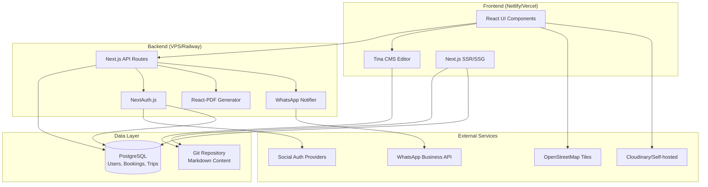

# Design Document: Sila Arctic Sailing Website

## Overview

The Sila Arctic Sailing platform is a full-stack web application built with React and Next.js, featuring a Git-based CMS for content management and PostgreSQL for relational data. The system separates concerns between static content (Markdown files in Git) and dynamic data (user accounts, bookings, trips in PostgreSQL).

The architecture follows a modern JAMstack approach with server-side rendering for SEO, static generation for content pages, and API routes for dynamic functionality. Authentication is handled via NextAuth.js with social providers, eliminating password management. Document generation uses React-PDF for on-demand PDF creation, and maps are rendered with Leaflet.js using free OpenStreetMap tiles.

Key design principles:
- Cost minimization (target: $0-10/month hosting)
- No vendor lock-in (open-source tools, portable data)
- GDPR compliance by design
- Bilingual support (Polish primary, English secondary)
- Mobile-first responsive design
- Content editor autonomy (no developer needed for content updates)

## Architecture

### System Components



### Technology Stack

**Frontend:**
- React 18+ (JavaScript, not TypeScript)
- Next.js 14+ (App Router for SSR/SSG)
- Tina CMS for content editing
- Leaflet.js + react-leaflet for maps
- Tailwind CSS for styling

**Backend:**
- Next.js API Routes
- NextAuth.js v5 for authentication
- React-PDF (@react-pdf/renderer) for document generation
- node-postgres (pg) for database access
- WhatsApp Business API client

**Data Storage:**
- Git repository for Markdown content
- PostgreSQL 15+ for relational data
- Cloudinary free tier or self-hosted with sharp for images

**Deployment:**
- Frontend: Netlify or Vercel (free tier with auto-deploy)
- Backend: Cheap VPS, Railway, or Render (free/low-cost tier)
- Database: Managed PostgreSQL or self-hosted

### Deployment Architecture

The system uses a split deployment model:

1. **Static Frontend**: Next.js frontend deployed to Netlify/Vercel with automatic Git-based deployments
2. **API Backend**: Next.js API routes deployed to VPS/Railway for database access and PDF generation
3. **Content Source**: Git repository serves as the source of truth for all Markdown content
4. **Database**: PostgreSQL instance (managed or self-hosted) for user and booking data

This separation allows the frontend to leverage free static hosting while keeping backend costs minimal.

## Components and Interfaces

### 1. Content Management System (CMS)

**Component: Tina CMS Integration**

Tina CMS provides a Git-based content editing interface that commits directly to the repository. Content editors access the CMS through `/admin` route.

**Content Schema:**
- Blog posts (with frontmatter: title, date, tags, tripId, images)
- Static pages (yacht info, skippers, sailing areas, packing guides)
- Destination pages (name, shortDescription, longDescription, images, coordinates)
- Gallery collections (organized by location/trip)

**CMS Configuration:**
```javascript
// tina/config.js structure
{
  collections: [
    {
      name: "blog",
      path: "content/blog",
      fields: [title, date, tags, tripId, body, images, gallery]
    },
    {
      name: "pages",
      path: "content/pages",
      fields: [title, slug, body]
    },
    {
      name: "destinations",
      path: "content/destinations",
      fields: [name, shortDescription, longDescription, coordinates, images]
    }
  ]
}
```

**Key Design Decisions:**
- Tina CMS chosen over Decap for better React integration and active development
- All content stored in `/content` directory with subdirectories by type
- Frontmatter metadata enables rich content relationships
- CMS runs client-side, commits via GitHub API

### 2. Authentication System

**Component: NextAuth.js with Social Providers**

NextAuth.js handles authentication with multiple social providers (Google, Facebook, GitHub). User sessions are stored in PostgreSQL.

**Authentication Flow:**
1. User clicks social login button
2. Redirected to provider OAuth flow
3. Provider returns user profile
4. NextAuth creates/updates user in database
5. Session cookie issued to client
6. Role-based access control applied

**User Roles:**
- Owner (2 accounts max): Full system access
- Skipper: Trip management, booking approval, document generation
- Crew_Member: Trip viewing, booking creation, profile management

**Database Adapter:**
NextAuth uses PostgreSQL adapter to store accounts, sessions, users, and verification tokens.

**Authorization Middleware:**
API routes check user role before allowing operations:
- Trip creation/editing: Skipper or Owner only
- Booking approval: Skipper or Owner only
- Crew list generation: Skipper or Owner only
- Profile editing: Own profile only
- Booking creation: Authenticated users only

### 3. Database Schema

**PostgreSQL Schema:**

```sql
-- Users (managed by NextAuth)
users (
  id UUID PRIMARY KEY,
  name TEXT,
  email TEXT UNIQUE,
  email_verified TIMESTAMP,
  image TEXT, -- Profile picture URL from social provider (e.g., Google avatar)
  role TEXT CHECK (role IN ('Owner', 'Skipper', 'Crew_Member')),
  created_at TIMESTAMP DEFAULT NOW()
)

-- User profiles (extended information)
user_profiles (
  user_id UUID PRIMARY KEY REFERENCES users(id) ON DELETE CASCADE,
  date_of_birth DATE,
  birth_place TEXT,
  passport_number TEXT,
  country_of_living TEXT,
  phone TEXT,
  next_of_kin_name TEXT,
  next_of_kin_phone TEXT,
  sailing_qualification TEXT CHECK (sailing_qualification IN 
    ('YACHTMASTER', 'DAY_SKIPPER', 'COMPETENT_CREW', 'SOME_EXPERIENCE', 'NONE')),
  sailing_certificate_number TEXT,
  radio_qualification TEXT CHECK (radio_qualification IN ('VHF', 'SSB', 'NONE')),
  gun_permit_caliber TEXT,
  gun_permit_country TEXT,
  medical_qualification TEXT CHECK (medical_qualification IN 
    ('FIRST_AID', 'PARAMEDIC', 'DOCTOR', 'NONE')),
  updated_at TIMESTAMP DEFAULT NOW()
)

-- Skippers
skippers (
  id UUID PRIMARY KEY DEFAULT gen_random_uuid(),
  name TEXT NOT NULL,
  certificate_name TEXT,
  certificate_number TEXT,
  phone TEXT,
  email TEXT,
  created_at TIMESTAMP DEFAULT NOW()
)

-- Yachts
yachts (
  id UUID PRIMARY KEY DEFAULT gen_random_uuid(),
  name TEXT NOT NULL,
  type TEXT,
  registration_number TEXT,
  home_port TEXT,
  length_feet DECIMAL(5,2), -- Length in feet (e.g., 42.5)
  engine_power_hp INTEGER,
  created_at TIMESTAMP DEFAULT NOW()
)

-- Trips
trips (
  id UUID PRIMARY KEY DEFAULT gen_random_uuid(),
  trip_number TEXT NOT NULL, -- From yacht logbook, not globally unique
  city TEXT,
  start_date DATE NOT NULL,
  end_date DATE NOT NULL,
  start_port TEXT,
  end_port TEXT,
  visited_ports TEXT[], -- Array of port names
  miles_sailed DECIMAL(8,2),
  number_of_days INTEGER,
  engine_hours DECIMAL(6,2),
  sailing_hours DECIMAL(6,2),
  night_hours DECIMAL(6,2),
  max_sea_state TEXT,
  max_wind_conditions TEXT,
  skipper_id UUID REFERENCES skippers(id),
  yacht_id UUID REFERENCES yachts(id),
  max_crew_size INTEGER DEFAULT 6,
  created_at TIMESTAMP DEFAULT NOW(),
  updated_at TIMESTAMP DEFAULT NOW()
)

-- Bookings
bookings (
  id UUID PRIMARY KEY DEFAULT gen_random_uuid(),
  user_id UUID REFERENCES users(id) ON DELETE CASCADE,
  trip_id UUID REFERENCES trips(id) ON DELETE CASCADE,
  status TEXT CHECK (status IN ('Reserved', 'Approved', '1st installment', 'Paid in full', 'Waitlist', 'Cancelled', 'Refunded')),
  created_at TIMESTAMP DEFAULT NOW(),
  updated_at TIMESTAMP DEFAULT NOW(),
  UNIQUE(user_id, trip_id)
)

-- Trip evaluations (for Opinia z Rejsu)
trip_evaluations (
  id UUID PRIMARY KEY DEFAULT gen_random_uuid(),
  booking_id UUID REFERENCES bookings(id) ON DELETE CASCADE,
  recommendation BOOLEAN,
  notes TEXT,
  created_at TIMESTAMP DEFAULT NOW(),
  UNIQUE(booking_id)
)

-- Indexes for performance
CREATE INDEX idx_bookings_user ON bookings(user_id);
CREATE INDEX idx_bookings_trip ON bookings(trip_id);
CREATE INDEX idx_trips_dates ON trips(start_date, end_date);
CREATE INDEX idx_users_email ON users(email);
```

**Design Rationale:**
- Separate tables for skippers and yachts enable reuse across trips
- User profiles extend NextAuth users table for GDPR-compliant deletion
- Booking status enum enforces valid state transitions
- Array type for visited_ports simplifies storage without additional table
- Trip evaluations linked to bookings (not users) for proper relationship
- Indexes on foreign keys and frequently queried fields

### 4. Trip Management System

**Component: Trip CRUD Operations**

**API Endpoints:**
- `POST /api/trips` - Create new trip (Skipper/Owner only)
- `GET /api/trips` - List all trips with filters (public)
- `GET /api/trips/[id]` - Get trip details (public)
- `PUT /api/trips/[id]` - Update trip (Skipper/Owner only)
- `DELETE /api/trips/[id]` - Delete trip (Owner only)

**Trip Creation Flow:**
1. Skipper fills trip form with dates, ports, yacht, statistics
2. System validates required fields
3. System creates trip record in database
4. System returns trip ID for content linking

**Trip Display Logic:**
- Calculate number of days from start_date and end_date
- Query bookings to determine availability status
- Join with skipper and yacht tables for display
- Filter by date range (past vs future)

### 5. Booking System

**Component: Booking Management**

**Booking State Machine:**
```
Reserved → Approved → 1st installment → Paid in full
    ↓           ↓            ↓               ↓
Waitlist    Cancelled   Cancelled       Cancelled
                ↓            ↓               ↓
            Refunded     Refunded        Refunded
```

**Status Transitions:**
- Any status → Cancelled (by crew member or Skipper/Owner)
- Cancelled → Refunded (by Skipper/Owner only)
- Waitlist → Reserved (automatic when spot opens)

**Cancellation Logic:**
- Crew member can cancel their own booking
- Skipper/Owner can cancel any booking
- Cancelled bookings do not count toward capacity
- Payment information is preserved for record-keeping
- Only Skipper/Owner can mark as Refunded

**API Endpoints:**
- `POST /api/bookings` - Create booking (authenticated users)
- `GET /api/bookings/my` - Get user's bookings (authenticated)
- `GET /api/bookings/trip/[tripId]` - Get trip bookings (Skipper/Owner)
- `PUT /api/bookings/[id]` - Update booking status (Skipper/Owner)
- `DELETE /api/bookings/[id]` - Cancel booking (user or Skipper/Owner)

**Booking Creation Logic:**
```javascript
function createBooking(userId, tripId) {
  // 1. Check if user already has booking for this trip
  // 2. Count approved bookings for trip
  // 3. If count < max_crew_size: status = 'Reserved'
  // 4. If count >= max_crew_size: status = 'Waitlist'
  // 5. Create booking record
  // 6. Send WhatsApp notification
  // 7. Return booking confirmation
}
```

**Capacity Management:**
- Query count of bookings with status IN ('Approved', '1st installment', 'Paid in full')
- Cancelled and Refunded bookings do not count toward capacity
- Compare against trip.max_crew_size
- Display "Full" badge when at capacity
- New bookings go to waitlist when full
- When a booking is cancelled, automatically promote first waitlist booking to Reserved

### 6. User Profile Management

**Component: Profile CRUD**

**Profile Form Fields:**
- Personal: name, date_of_birth, birth_place, passport_number, country_of_living
- Contact: phone, email
- Emergency: next_of_kin_name, next_of_kin_phone
- Qualifications: sailing_qualification, sailing_certificate_number, radio_qualification, gun_permit_caliber, gun_permit_country, medical_qualification

**Conditional Fields:**
- sailing_certificate_number: Required when sailing_qualification is Yachtmaster, Day Skipper, or Competent Crew
- gun_permit_caliber, gun_permit_country: Optional, shown when user has gun permit

**API Endpoints:**
- `GET /api/profile` - Get current user profile
- `PUT /api/profile` - Update current user profile
- `DELETE /api/profile` - Delete user account and all data (GDPR)

**GDPR Compliance:**
- Cascade delete from users to user_profiles and bookings
- Export endpoint: `GET /api/profile/export` returns all user data as JSON
- Delete endpoint removes all personal data permanently

### 7. Document Generation System

**Component: PDF Generator using React-PDF**

Two document templates are required:

**Crew List Template:**
- Header: Trip information (number, dates, yacht, skipper)
- Table: All crew members with approved bookings
- Columns: Name, Date of Birth, Passport Number, Sailing Qualification, Radio Qualification, Medical Qualification
- Footer: Generation date, skipper signature line

**Opinia z Rejsu Template:**
- Header: Crew member name and trip information
- Body: Trip statistics (miles, days, hours, conditions)
- Evaluation: Recommendation (yes/no), skipper notes
- Footer: Skipper signature, date

**Implementation Approach:**
```javascript
// React-PDF component structure
<Document>
  <Page size="A4">
    <View style={styles.header}>
      {/* Trip/crew info */}
    </View>
    <View style={styles.table}>
      {/* Crew list or statistics */}
    </View>
    <View style={styles.footer}>
      {/* Signatures */}
    </View>
  </Page>
</Document>
```

**API Endpoints:**
- `GET /api/documents/crew-list/[tripId]` - Generate crew list PDF
- `GET /api/documents/opinia/[bookingId]` - Generate Opinia z Rejsu PDF

**Generation Flow:**
1. API route receives request with authentication check
2. Query database for required data (trip, crew, evaluations)
3. Render React-PDF component with data
4. Stream PDF to client with appropriate headers
5. Client browser handles download/print

**Design Note:** PDFs are generated on-demand and not stored to minimize storage costs and ensure data freshness.

### 8. Blog and Content Display

**Component: Content Rendering System**

**Blog Post Structure:**
```markdown
---
title: "Trip to Svalbard 2024"
date: 2024-07-15
tags: ["Svalbard", "Summer"]
tripId: "uuid-of-trip"
featuredImage: "/images/svalbard-hero.jpg"
gallery: ["/images/1.jpg", "/images/2.jpg"]
lang: "pl"
---

Blog content in Markdown...
```

**Content Rendering Pipeline:**
1. Next.js reads Markdown files at build time (SSG)
2. Parse frontmatter metadata
3. Convert Markdown body to HTML
4. If tripId present, fetch trip data from database
5. Generate map from trip ports
6. Display trip statistics
7. Render blog post with embedded content

**Map Generation:**
When blog post has tripId:
1. Query trip.visited_ports from database
2. Geocode port names to coordinates (cached)
3. Render Leaflet map with markers
4. Draw simplified polyline following coastline approximation
5. No GPS tracks or straight lines over land

**Social Sharing:**
- Open Graph meta tags for Facebook/Twitter
- Share buttons for common platforms
- Dynamic preview images

### 9. Destination Database

**Component: Destination Pages**

**Content Structure:**
Each destination is a Markdown file with:
```markdown
---
name: "Longyearbyen"
coordinates: [78.2232, 15.6267]
images: ["dest1.jpg", "dest2.jpg"]
lang: "pl"
---

## Short Description
Brief intro...

## Long Description
Detailed information...
```

**Destination Display:**
1. List all destinations with short descriptions
2. Link to detail page showing long description and gallery
3. Query trips table for upcoming trips visiting this destination
4. Display "Upcoming trips to this destination" section

**Image Tagging:**
- Manual tags in frontmatter take precedence
- EXIF data extraction optional (if cost-effective)
- Images organized by destination/trip in file structure

### 10. Notification System

**Component: WhatsApp Notifier**

**Integration Approach:**
Use WhatsApp Business API (Cloud API by Meta) for notifications. This requires:
- WhatsApp Business Account
- Phone number verification
- Webhook endpoint for receiving messages (optional)
- Access token for sending messages

**Notification Triggers:**
- New booking created: Send to skipper group
- Booking status changed: Send to skipper group
- Trip approaching: Send to crew members (future enhancement)

**Message Format:**
```
🚢 New Booking Alert

Crew Member: [Name]
Trip: [Trip Number] - [City]
Dates: [Start Date] to [End Date]
Status: Reserved
Time: [Timestamp]

View details: [Link to admin panel]
```

**Implementation:**
```javascript
async function sendWhatsAppNotification(booking) {
  const message = formatBookingMessage(booking);
  await whatsappClient.sendMessage({
    to: process.env.WHATSAPP_GROUP_ID,
    type: 'text',
    text: { body: message }
  });
}
```

**Cost Consideration:**
WhatsApp Business API has free tier for low-volume messaging (suitable for booking notifications).

### 11. Bilingual Support

**Component: Language Switcher**

**Implementation Strategy:**
- Content-level language support (not UI translation library)
- Each Markdown file has `lang` field in frontmatter
- Language switcher in header toggles between 'pl' and 'en'
- Filter content by selected language
- Hide content without translation in English mode

**Enum Translation System:**

Database stores simple enum codes (e.g., 'YACHTMASTER', 'DAY_SKIPPER', 'NONE'), while UI displays human-friendly labels based on selected language.

```javascript
// locales/pl.json
{
  "nav.trips": "Rejsy",
  "nav.blog": "Blog",
  "booking.reserve": "Zarezerwuj",
  "qualification.YACHTMASTER": "Kapitan Jachtowy",
  "qualification.DAY_SKIPPER": "Sternik Jachtowy",
  "qualification.COMPETENT_CREW": "Żeglarz Jachtowy",
  "qualification.SOME_EXPERIENCE": "Trochę doświadczenia",
  "qualification.NONE": "Brak",
  "radio.VHF": "VHF",
  "radio.SSB": "SSB",
  "radio.NONE": "Brak",
  "medical.FIRST_AID": "Pierwsza pomoc",
  "medical.PARAMEDIC": "Ratownik medyczny",
  "medical.DOCTOR": "Lekarz",
  "medical.NONE": "Brak"
}

// locales/en.json
{
  "nav.trips": "Trips",
  "nav.blog": "Blog",
  "booking.reserve": "Reserve",
  "qualification.YACHTMASTER": "Yachtmaster",
  "qualification.DAY_SKIPPER": "Day Skipper",
  "qualification.COMPETENT_CREW": "Competent Crew",
  "qualification.SOME_EXPERIENCE": "Some Experience",
  "qualification.NONE": "None",
  "radio.VHF": "VHF",
  "radio.SSB": "SSB",
  "radio.NONE": "None",
  "medical.FIRST_AID": "First Aid",
  "medical.PARAMEDIC": "Paramedic",
  "medical.DOCTOR": "Doctor",
  "medical.NONE": "None"
}
```

**Translation Helper:**
```javascript
function translateEnum(enumValue, category, language) {
  const key = `${category}.${enumValue}`;
  return translations[language][key] || enumValue;
}

// Usage:
translateEnum('YACHTMASTER', 'qualification', 'pl') // Returns "Kapitan Jachtowy"
translateEnum('YACHTMASTER', 'qualification', 'en') // Returns "Yachtmaster"
```

**Content Language Detection:**
```javascript
function getContentByLanguage(allContent, selectedLang) {
  return allContent.filter(item => {
    if (selectedLang === 'pl') return true; // Show all in Polish mode
    return item.lang === 'en'; // Only show English content in English mode
  });
}
```

### 12. Map Rendering System

**Component: Leaflet Map Generator**

**Map Display:**
- Use react-leaflet for React integration
- OpenStreetMap tiles (free, no API key required)
- Simplified route visualization

**Route Rendering:**
```javascript
function renderTripMap(ports) {
  // 1. Geocode port names to coordinates
  // 2. Create markers for each port
  // 3. Draw polyline connecting ports
  // 4. Fit map bounds to show all ports
  // 5. Add port labels and descriptions
}
```

**Coastline Approximation:**
- Use simple polyline between ports (not GPS tracks)
- Rely on visual approximation rather than precise routing
- No need for routing API (keeps costs zero)

**Map Configuration:**
```javascript
<MapContainer center={[78.0, 15.0]} zoom={5}>
  <TileLayer
    url="https://{s}.tile.openstreetmap.org/{z}/{x}/{y}.png"
    attribution='&copy; OpenStreetMap contributors'
  />
  {ports.map(port => (
    <Marker position={port.coordinates}>
      <Popup>{port.name}</Popup>
    </Marker>
  ))}
  <Polyline positions={ports.map(p => p.coordinates)} />
</MapContainer>
```

### 13. Image Optimization

**Component: Image Handler**

**Strategy Decision Tree:**
1. If Cloudinary free tier sufficient (25GB storage, 25GB bandwidth/month):
   - Use Cloudinary for storage and transformation
   - Automatic format optimization (WebP)
   - Responsive image URLs
2. If exceeding Cloudinary limits:
   - Self-host images in `/public/images`
   - Use sharp library for optimization at build time
   - Generate multiple sizes (thumbnail, medium, large)

**Image Processing Pipeline:**
```javascript
// Build-time optimization with sharp
async function optimizeImage(inputPath, outputPath) {
  await sharp(inputPath)
    .resize(1920, 1080, { fit: 'inside', withoutEnlargement: true })
    .webp({ quality: 85 })
    .toFile(outputPath);
}
```

**Responsive Images:**
```javascript

```

### 14. Responsive Design System

**Component: Layout System**

**Breakpoints:**
- Mobile: < 640px
- Tablet: 640px - 1024px
- Desktop: > 1024px

**Layout Patterns:**
- Mobile: Single column, hamburger menu, stacked cards
- Tablet: Two columns where appropriate, collapsible menu
- Desktop: Multi-column layouts, persistent navigation, sidebars

**Tailwind Configuration:**
```javascript
// tailwind.config.js
module.exports = {
  theme: {
    screens: {
      'sm': '640px',
      'md': '768px',
      'lg': '1024px',
      'xl': '1280px',
    }
  }
}
```

**Responsive Components:**
- Navigation: Hamburger menu on mobile, horizontal nav on desktop
- Trip cards: Stack on mobile, grid on desktop
- Forms: Full-width on mobile, constrained on desktop
- Images: Responsive sizing with srcset
- Tables: Horizontal scroll on mobile, full display on desktop

## Data Models

### User Model

```javascript
{
  id: "uuid",
  name: "Jan Kowalski",
  email: "jan@example.com",
  role: "Crew_Member",
  profile: {
    dateOfBirth: "1990-05-15",
    birthPlace: "Warsaw",
    passportNumber: "AB1234567",
    countryOfLiving: "Poland",
    phone: "+48123456789",
    nextOfKinName: "Anna Kowalska",
    nextOfKinPhone: "+48987654321",
    sailingQualification: "Day Skipper/Sternik",
    sailingCertificateNumber: "DS-12345",
    radioQualification: "VHF",
    gunPermitCaliber: null,
    gunPermitCountry: null,
    medicalQualification: "First-aid"
  },
  bookings: [/* array of booking objects */]
}
```

### Trip Model

```javascript
{
  id: "uuid",
  tripNumber: "SV-2024-03",
  city: "Longyearbyen",
  startDate: "2024-07-01",
  endDate: "2024-07-14",
  startPort: "Longyearbyen",
  endPort: "Longyearbyen",
  visitedPorts: ["Longyearbyen", "Pyramiden", "Ny-Ålesund", "Magdalenefjorden"],
  milesSailed: 245.5,
  numberOfDays: 14,
  engineHours: 12.5,
  sailingHours: 85.0,
  nightHours: 18.0,
  maxSeaState: "3-4",
  maxWindConditions: "Force 6",
  skipper: {
    id: "uuid",
    name: "Piotr Nowak",
    certificateName: "Kapitan Jachtowy",
    certificateNumber: "KJ-98765",
    phone: "+48111222333",
    email: "piotr@example.com"
  },
  yacht: {
    id: "uuid",
    name: "Sila",
    type: "Hallberg-Rassy 42",
    registrationNumber: "POL-123",
    homePort: "Gdynia",
    lengthFeet: 42.0,
    enginePowerHp: 75
  },
  maxCrewSize: 6,
  currentBookings: 4,
  availableSpots: 2
}
```

### Booking Model

```javascript
{
  id: "uuid",
  userId: "uuid",
  tripId: "uuid",
  status: "Approved",
  user: {
    name: "Jan Kowalski",
    email: "jan@example.com",
    profile: {/* user profile data */}
  },
  trip: {/* trip summary */},
  evaluation: {
    recommendation: true,
    notes: "Excellent crew member, good sailing skills"
  },
  createdAt: "2024-01-15T10:30:00Z",
  updatedAt: "2024-01-20T14:45:00Z"
}
```

### Content Models

**Blog Post:**
```javascript
{
  slug: "svalbard-summer-2024",
  title: "Arctic Summer in Svalbard",
  date: "2024-07-20",
  tags: ["Svalbard", "Summer"],
  tripId: "uuid",
  featuredImage: "/images/svalbard-hero.jpg",
  gallery: ["/images/1.jpg", "/images/2.jpg"],
  body: "Markdown content...",
  lang: "pl",
  trip: {/* populated trip data if tripId present */}
}
```

**Destination:**
```javascript
{
  slug: "longyearbyen",
  name: "Longyearbyen",
  coordinates: [78.2232, 15.6267],
  shortDescription: "The world's northernmost settlement",
  longDescription: "Detailed information...",
  images: ["dest1.jpg", "dest2.jpg"],
  upcomingTrips: [/* trips visiting this destination */],
  lang: "pl"
}
```


## Correctness Properties

A property is a characteristic or behavior that should hold true across all valid executions of a system—essentially, a formal statement about what the system should do. Properties serve as the bridge between human-readable specifications and machine-verifiable correctness guarantees.

### Property 1: Content changes create Git commits
*For any* content modification (create, update, delete) made through the CMS, the system should create a corresponding Git commit in the repository.
**Validates: Requirements 1.3**

### Property 2: Trip data completeness
*For any* trip created in the system, all required fields (trip number, city, start date, end date, start port, end port, visited ports, statistics, max conditions) should be stored in the database.
**Validates: Requirements 2.2, 2.3, 2.4**

### Property 3: Trip-skipper referential integrity
*For any* trip in the database, the skipper_id should reference a valid skipper record.
**Validates: Requirements 2.5**

### Property 4: Trip-yacht referential integrity
*For any* trip in the database, the yacht_id should reference a valid yacht record.
**Validates: Requirements 2.6**

### Property 5: Skipper data completeness
*For any* skipper record, all required fields (name, certificate name, certificate number, phone, email) should be present.
**Validates: Requirements 3.2**

### Property 6: Yacht data completeness
*For any* yacht record, all required fields (name, type, registration number, home port, length, engine power) should be present.
**Validates: Requirements 3.4**

### Property 7: Skipper and yacht reusability
*For any* skipper or yacht record, the system should allow multiple trips to reference the same record without conflicts.
**Validates: Requirements 3.7**

### Property 8: Blog post Markdown format
*For any* blog post created through the CMS, it should be stored as a valid Markdown file with parseable frontmatter metadata.
**Validates: Requirements 4.1**

### Property 9: Blog post categorization by tags
*For any* blog post with tags, querying posts by a specific tag should return all posts containing that tag.
**Validates: Requirements 4.4**

### Property 10: Trip-linked blog posts generate maps
*For any* blog post with a tripId, the rendered page should include a Leaflet map with markers for all ports in the trip's visited_ports array.
**Validates: Requirements 4.5**

### Property 11: Trip-linked blog posts display statistics
*For any* blog post with a tripId, the rendered page should display all trip statistics (miles, days, hours, conditions).
**Validates: Requirements 4.6**

### Property 12: Destination data completeness
*For any* destination page, both short description and long description fields should be present.
**Validates: Requirements 6.2**

### Property 13: Destination gallery display
*For any* destination with images in its frontmatter, the rendered page should display a gallery containing all specified images.
**Validates: Requirements 6.3**

### Property 14: Manual tags take precedence
*For any* image with both manual tags and EXIF data, the system should use the manual tags for categorization.
**Validates: Requirements 6.7**

### Property 15: Image optimization
*For any* image uploaded to the system, it should be optimized (converted to WebP or similar format with reduced file size) before serving.
**Validates: Requirements 6.8**

### Property 16: Destination shows related trips
*For any* destination, if any trips include that destination in their visited_ports array, those trips should be displayed on the destination page.
**Validates: Requirements 6.10**

### Property 17: Trip list displays required fields
*For any* trip in the trip list view, the rendered output should include date, title, start port, end port, calculated number of days, skipper name, and availability status.
**Validates: Requirements 7.2**

### Property 18: Trip list shows only fixed-date trips
*For any* trip displayed in the trip list, it should have both start_date and end_date defined (no open-ended trips).
**Validates: Requirements 7.3**

### Property 19: Full trips are marked correctly
*For any* trip where the count of approved bookings (status IN 'Approved', '1st installment', 'Paid in full') equals or exceeds max_crew_size, the trip should be marked as "Full".
**Validates: Requirements 7.4**

### Property 20: Trip detail page completeness
*For any* trip detail page, it should display all trip list fields plus the complete itinerary with port descriptions.
**Validates: Requirements 7.6**

### Property 21: Itinerary displays all ports
*For any* trip with visited_ports, the itinerary should list all ports with their descriptions.
**Validates: Requirements 7.7**

### Property 22: Multiple itinerary variants displayed
*For any* trip with multiple itinerary variants defined, all variants should be displayed on the trip detail page.
**Validates: Requirements 7.8**

### Property 23: Itinerary ports link to destinations
*For any* port listed in a trip itinerary, there should be a link to that port's destination detail page.
**Validates: Requirements 7.9**

### Property 24: Booking status based on capacity
*For any* booking creation, if the trip has available spots (approved bookings < max_crew_size), the booking status should be "Reserved"; otherwise it should be "Waitlist".
**Validates: Requirements 8.1, 8.2**

### Property 25: Valid booking status transitions
*For any* booking, skippers should be able to transition the status to "Approved", "1st installment", or "Paid in full" from any current status.
**Validates: Requirements 8.3**

### Property 26: Crew member booking view restrictions
*For any* crew member viewing their own bookings, the displayed information should not include detailed payment status (only basic interest level).
**Validates: Requirements 8.4**

### Property 27: Skipper booking view permissions
*For any* skipper or owner viewing bookings, the displayed information should include full booking details and payment status.
**Validates: Requirements 8.5**

### Property 28: Maximum crew size enforcement
*For any* trip, the count of bookings with status IN ('Approved', '1st installment', 'Paid in full') should never exceed the trip's max_crew_size.
**Validates: Requirements 8.6**

### Property 29: Booking requires approval
*For any* booking, it should not transition to "Approved" status without explicit skipper action (no auto-approval).
**Validates: Requirements 8.7**

### Property 29a: Cancelled bookings don't count toward capacity
*For any* trip capacity calculation, bookings with status "Cancelled" or "Refunded" should not be included in the count.
**Validates: Requirements 8.6**

### Property 29b: Refund requires skipper authorization
*For any* booking status transition to "Refunded", the requester must have role "Skipper" or "Owner".
**Validates: Requirements 8.3**

### Property 29c: Waitlist promotion on cancellation
*For any* booking cancellation that frees a spot, if waitlist bookings exist for that trip, the oldest waitlist booking should be automatically promoted to "Reserved" status.
**Validates: Requirements 8.2**

### Property 30: Booking creation triggers notification
*For any* booking creation, a WhatsApp notification should be sent to the configured group.
**Validates: Requirements 9.1**

### Property 31: Notification message completeness
*For any* WhatsApp notification, the message should contain crew member name, trip details, and booking timestamp.
**Validates: Requirements 9.2**

### Property 32: Status changes trigger notifications
*For any* booking status update, a WhatsApp notification should be sent.
**Validates: Requirements 9.3**

### Property 33: User role validation
*For any* authenticated user, their role should be one of: "Owner", "Skipper", or "Crew_Member".
**Validates: Requirements 10.4**

### Property 34: Owner role limit
*At any* point in time, the count of users with role "Owner" should be at most 2.
**Validates: Requirements 10.5**

### Property 35: Skipper permissions
*For any* user with role "Skipper", they should have permissions to create trips, edit trips, and approve bookings.
**Validates: Requirements 10.6**

### Property 36: Crew member permissions
*For any* user with role "Crew_Member", they should have permissions to view trips and create bookings.
**Validates: Requirements 10.7**

### Property 37: Profile data completeness for booking
*For any* booking creation, the user's profile should contain all required fields: name, date of birth, birth place, passport number, country of living, phone, and email.
**Validates: Requirements 11.1**

### Property 38: Emergency contact information
*For any* user profile, next of kin name and phone number should be present.
**Validates: Requirements 11.2**

### Property 39: Sailing qualification enum validation
*For any* user profile, the sailing qualification should be one of: "YACHTMASTER", "DAY_SKIPPER", "COMPETENT_CREW", "SOME_EXPERIENCE", or "NONE".
**Validates: Requirements 11.3**

### Property 40: Certificate number requirement
*For any* user profile with sailing qualification of "YACHTMASTER", "DAY_SKIPPER", or "COMPETENT_CREW", the sailing certificate number should be present.
**Validates: Requirements 11.4**

### Property 41: Radio qualification enum validation
*For any* user profile, the radio qualification should be one of: "VHF", "SSB", or "NONE".
**Validates: Requirements 11.5**

### Property 42: Gun permit conditional fields
*For any* user profile with gun permit information, both caliber and country should be present.
**Validates: Requirements 11.6**

### Property 43: Medical qualification enum validation
*For any* user profile, the medical qualification should be one of: "FIRST_AID", "PARAMEDIC", "DOCTOR", or "NONE".
**Validates: Requirements 11.7**

### Property 44: Profile displays booking history
*For any* user viewing their profile, all their bookings (current and past) should be displayed.
**Validates: Requirements 11.8**

### Property 45: GDPR data deletion
*For any* user deletion request, all related records (user, user_profile, bookings) should be removed from the database.
**Validates: Requirements 12.2**

### Property 46: Language filtering for English mode
*For any* content item, it should be visible in English mode if and only if its lang field is "en".
**Validates: Requirements 13.3, 13.4**

### Property 47: Crew list generation
*For any* crew list request by a Skipper or Owner, a valid PDF document should be generated.
**Validates: Requirements 14.1**

### Property 48: Crew list includes approved bookings
*For any* crew list for a trip, it should include exactly the crew members whose bookings have status IN ('Approved', '1st installment', 'Paid in full').
**Validates: Requirements 14.2**

### Property 49: Crew list field completeness
*For any* crew member entry in a crew list, it should display name, date of birth, passport number, sailing qualification, radio qualification, and medical qualification.
**Validates: Requirements 14.3**

### Property 50: Crew list access control
*For any* crew list request, it should be rejected (403 Forbidden) if the requester's role is not "Skipper" or "Owner".
**Validates: Requirements 14.4**

### Property 51: Opinia generation
*For any* Opinia z Rejsu request by the crew member or Skipper/Owner after trip completion, a valid PDF document should be generated.
**Validates: Requirements 15.1**

### Property 52: Opinia document completeness
*For any* Opinia z Rejsu document, it should include crew member personal information, trip details (number, city, dates), trip statistics (miles, days, hours, conditions), recommendation field, and notes field.
**Validates: Requirements 15.2, 15.3, 15.4, 15.5**

### Property 53: Opinia access control
*For any* Opinia z Rejsu request, it should be rejected if the requester is not the crew member associated with the booking or a Skipper/Owner.
**Validates: Requirements 15.6**

### Property 54: Trip-linked blog posts render maps
*For any* blog post with a tripId, the rendered page should include a Leaflet map component.
**Validates: Requirements 16.1**

## Error Handling

### Authentication Errors
- **Unauthorized Access**: Return 401 when user not authenticated
- **Forbidden Access**: Return 403 when user lacks required role
- **Invalid Provider**: Handle OAuth failures gracefully with user-friendly messages
- **Session Expiry**: Redirect to login with return URL

### Database Errors
- **Connection Failures**: Retry with exponential backoff, return 503 if persistent
- **Constraint Violations**: Return 400 with specific error message (e.g., "Trip number already exists")
- **Foreign Key Violations**: Return 400 with clear message (e.g., "Invalid skipper ID")
- **Transaction Failures**: Rollback and return 500 with generic error

### Booking Errors
- **Duplicate Booking**: Return 400 "You already have a booking for this trip"
- **Trip Full**: Create waitlist booking instead of failing
- **Missing Profile**: Return 400 "Complete your profile before booking"
- **Invalid Status Transition**: Return 400 "Cannot change status from X to Y"

### Content Errors
- **Invalid Markdown**: Log error, display fallback content
- **Missing Frontmatter**: Use defaults, log warning
- **Invalid Trip Reference**: Display blog post without trip data, log warning
- **Image Load Failure**: Display placeholder image

### PDF Generation Errors
- **Missing Data**: Return 400 "Incomplete data for document generation"
- **Rendering Failure**: Return 500, log detailed error for debugging
- **Access Denied**: Return 403 with clear message

### WhatsApp Notification Errors
- **API Failure**: Log error, do not block booking creation
- **Rate Limit**: Queue notification for retry
- **Invalid Configuration**: Log error, continue without notification

### General Error Handling Strategy
- All API routes wrapped in try-catch with consistent error response format
- Client-side error boundaries for React components
- User-friendly error messages (no stack traces to users)
- Detailed error logging for debugging
- Graceful degradation (e.g., booking succeeds even if notification fails)

## Testing Strategy

### Dual Testing Approach

The system requires both unit testing and property-based testing for comprehensive coverage:

**Unit Tests:**
- Specific examples demonstrating correct behavior
- Edge cases (empty inputs, boundary values, special characters)
- Error conditions and exception handling
- Integration points between components
- Authentication and authorization flows

**Property-Based Tests:**
- Universal properties that hold for all inputs
- Data model validation across random inputs
- Business logic correctness with generated test data
- Minimum 100 iterations per property test
- Each test tagged with: **Feature: sila-arctic-sailing, Property {N}: {property text}**

### Testing Framework Selection

**JavaScript Testing Stack:**
- Jest for unit testing
- fast-check for property-based testing
- React Testing Library for component tests
- Supertest for API endpoint tests
- Playwright for end-to-end tests (optional)

### Property-Based Testing Configuration

Each correctness property from the design should be implemented as a property-based test:

```javascript
// Example property test structure
import fc from 'fast-check';

describe('Feature: sila-arctic-sailing, Property 2: Trip data completeness', () => {
  it('should store all required trip fields', () => {
    fc.assert(
      fc.property(
        fc.record({
          tripNumber: fc.string({ minLength: 1 }),
          city: fc.string({ minLength: 1 }),
          startDate: fc.date(),
          endDate: fc.date(),
          startPort: fc.string({ minLength: 1 }),
          endPort: fc.string({ minLength: 1 }),
          visitedPorts: fc.array(fc.string({ minLength: 1 }), { minLength: 1 }),
          // ... other fields
        }),
        async (tripData) => {
          const createdTrip = await createTrip(tripData);
          const retrievedTrip = await getTripById(createdTrip.id);
          
          expect(retrievedTrip.tripNumber).toBe(tripData.tripNumber);
          expect(retrievedTrip.city).toBe(tripData.city);
          // ... verify all fields
        }
      ),
      { numRuns: 100 }
    );
  });
});
```

### Test Coverage Goals

- Unit test coverage: 80%+ for business logic
- Property tests: One test per correctness property
- Integration tests: All API endpoints
- Component tests: All user-facing components
- E2E tests: Critical user flows (booking, document generation)

### Testing Priorities

**High Priority (Must Test):**
- Booking capacity logic and status transitions
- User profile data validation and GDPR deletion
- Document generation (crew list, Opinia)
- Authentication and authorization
- Trip-booking relationships

**Medium Priority (Should Test):**
- Content rendering and language filtering
- Map generation from trip data
- Image optimization
- WhatsApp notifications

**Low Priority (Nice to Test):**
- UI responsiveness
- Social sharing
- CMS integration

### Continuous Integration

- Run all tests on every commit
- Block merges if tests fail
- Generate coverage reports
- Run property tests with 100 iterations in CI
- Run E2E tests on staging environment before production deploy
